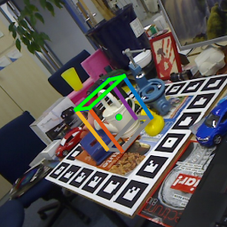
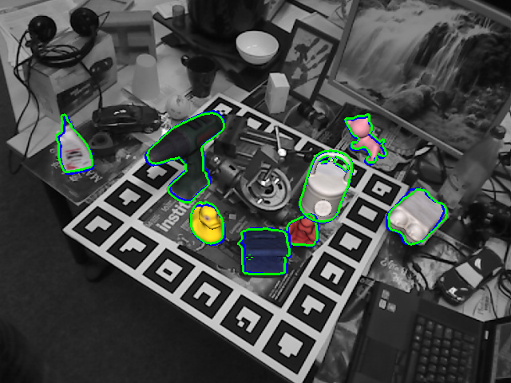

# 6D_Pose

# Visualization
The visualization results are as follows:   
[lm_vis](https://github.com/peppa114/6D_Pose/tree/main/visualization/lm)   
    
[lmo_vis](https://github.com/peppa114/6D_Pose/tree/main/visualization/lmo)  
    
[ycb_vis](https://github.com/peppa114/6D_Pose/tree/main/visualization/ycb)  
   

# Models
